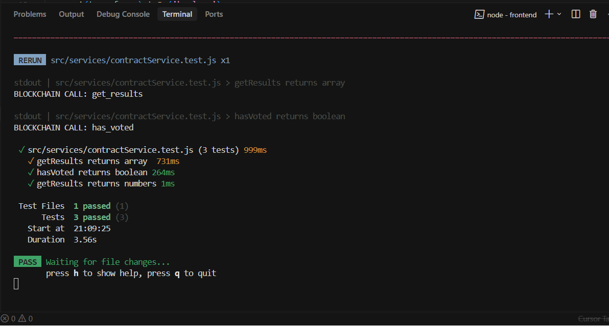
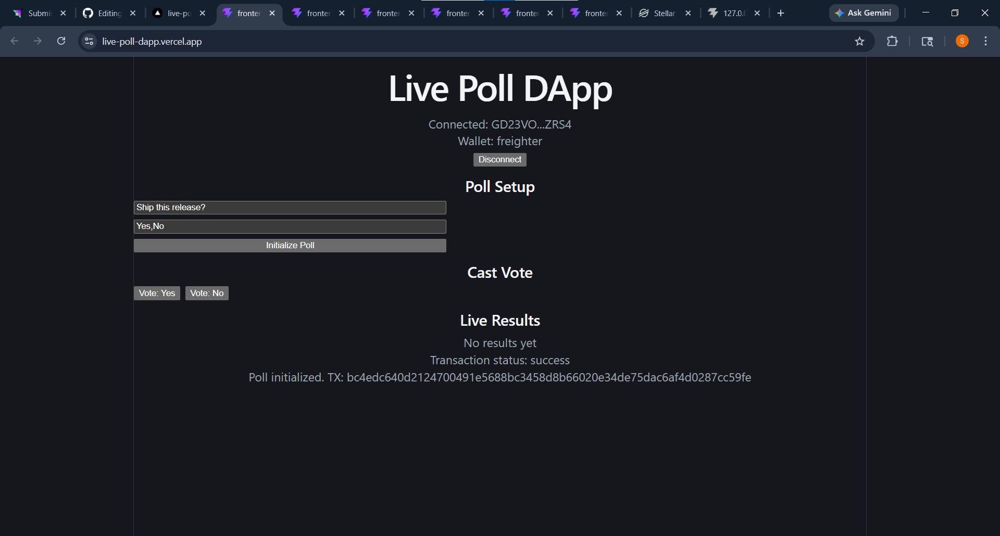
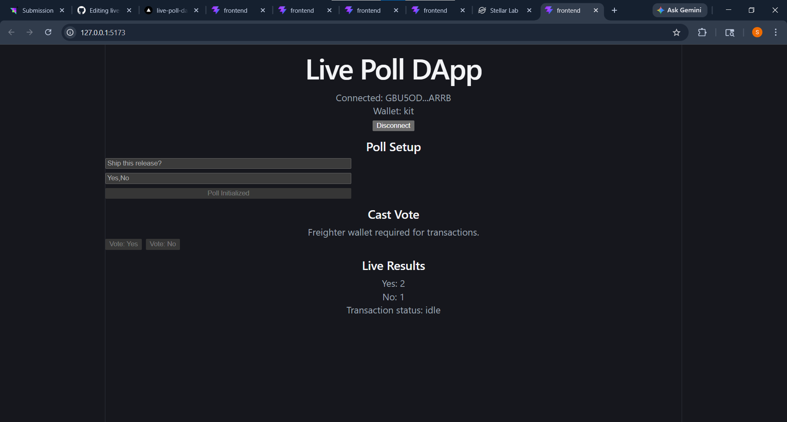
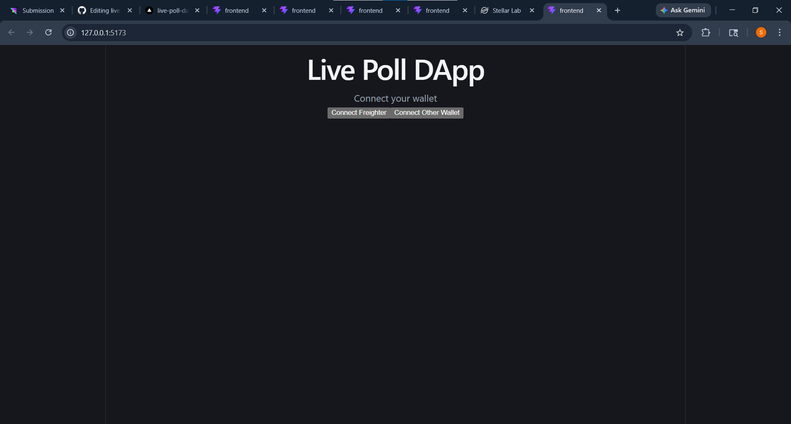

#  Live Poll DApp (Stellar Soroban)

## Overview

A real-time decentralized polling application built on the **Stellar Soroban smart contract platform**.

Users can:

* Connect their wallet
* Initialize a poll
* Vote securely (one vote per wallet)
* View live results directly from the blockchain

---

## Live Demo

https://live-poll-dapp.vercel.app

---

##  Demo Video

This video demonstrates:
- Wallet connection
- Poll initialization
- Voting functionality
- Live results update

[ Watch Demo Video](https://github.com/shagunj791/live-poll-dapp/raw/refs/heads/main/frontend/public/screenshots/demo.mp4)

---

##  Test Execution Video

This video demonstrates:
- Smart contract test execution
- Validation of poll logic

[ Watch Tests Video](.frontend/public/screenshots/tests.mp4)

##  Features

* Multi-wallet support:

  * Freighter (transaction signing)
  * Stellar Wallets Kit (connection)

* Core functionality:

  * Initialize poll with custom question and options
  * Vote securely (one vote per wallet enforced via contract)
  * Fetch live results from blockchain

* Real-time updates:

  * Results auto-refresh

* Transaction lifecycle tracking:

  * pending
  * success
  * error

* Error handling:

  * Wallet not installed
  * User rejected transaction
  * Already voted
  * Poll not initialized

---

##  L3 Enhancements

*  Loading states:

  * Processing (poll initialization)
  * Submitting vote
  * Refreshing results

*  Basic caching:

  * Results cached for 5 seconds
  * Reduces unnecessary blockchain calls

*  Automated testing:

  * 3+ tests implemented using Vitest

---

##  Tech Stack

* Frontend: React (Vite)
* Blockchain: Stellar Soroban
* Wallet: Freighter
* SDK: @stellar/stellar-sdk
* Testing: Vitest

---

##  How It Works

1. User connects wallet
2. Initializes poll (question + options)
3. Smart contract stores poll data
4. Users vote via signed transactions
5. Results fetched from blockchain
6. UI updates in real-time

---

##  Project Structure

```
src/
 ├── components/
 │    ├── WalletConnector.jsx
 │    ├── PollPanel.jsx
 │    ├── PollSetup.jsx
 │    ├── VotingPanel.jsx
 │    └── ResultsPanel.jsx
 │
 ├── services/
 │    ├── contractService.js
 │    ├── contractService.test.js
 │    └── walletService.js
```

---

##  Setup Instructions

```bash
git clone https://github.com/<your-username>/live-poll-dapp.git
cd live-poll-dapp/frontend

npm install
npm run dev
```

---

##  Run Tests

```bash
npm test
```

---

##  Tests

The application includes automated tests using **Vitest**:

* getResults returns array
* hasVoted returns boolean
* getResults returns numbers

###  Test Output



> Note: These are integration tests interacting with Soroban testnet.

---

##  Smart Contract Details

* Network: Stellar Testnet

### Contract Address

CBQUA67LVRIKB74W4MIEG7UE2MXSZS6CAV26DSVZQMBKWAP4IQGH2UTU

---

##  Sample Transaction

Initialize Poll TX:

15317260a33775cedbb65bcb5435e846d5e87488984261554ba8d893d2cacd01

🔗 Explorer:
https://stellar.expert/explorer/testnet/tx/15317260a33775cedbb65bcb5435e846d5e87488984261554ba8d893d2cacd01

---

##  Screenshots

### Wallet Connected + Poll Initialized



### Multi-Wallet Support



### Initial Connect Screen



---

##  UX Improvements

* Buttons disabled during transactions
* Real-time transaction feedback
* Clear loading indicators
* Prevents duplicate submissions

---

##  Performance

* Poll results cached for 5 seconds
* Reduces RPC load
* Improves UI responsiveness

---

##  Requirement Checklist

* ✅ Fully functional mini-dApp
* ✅ Smart contract deployed and used
* ✅ Read + write blockchain interaction
* ✅ Loading states implemented
* ✅ Caching implemented
* ✅ 3+ tests passing
* ✅ README complete
* ✅ Multiple commits

---

##  Notes

* Only Freighter wallet can sign transactions
* Other wallets can connect (read-only mode)
* Poll can only be initialized once per contract

---

##  Author

Shagun Jain
CSE Student

---

##  License

MIT License
